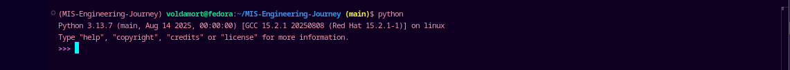

# THE PYTHON COMMAND LINE

To test a short amount of code in python sometimes it is quickest and easiest not to write the code in a file. This is made possible because Python can run as a command line itself.

Type the following on the terminal:

```bash
$ python
```


From there you can write any python code, including our hello world example from earlier in the tutorial:

```python
print('Hello, World!')
```

This will write `Hello, World!!` in the command line.

Whenever you are done in the python command line, you can simply type the following to quit the python command line interface.

```python
exit()
```
